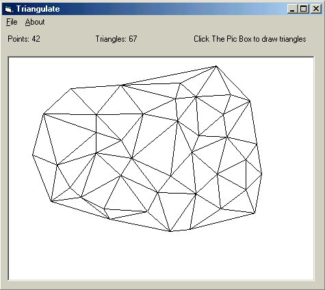



## Delaunay Triangulation

### Description

Perform triangulation on a set of 'N' points. I couldn't find any VB Code to do this, so I converted a Fortran 77 program written by Paul Bourke. This is my first ever submission to PSC, please be nice. :)
 
### More Info
 
Click the Picture Box to add points.

Returns the number of triangles created as well as the vertex points.

None known

             |
---                |---
**Submitted On**   |2001-09-19 10:45:56
**By**             |[EluZioN](https://github.com/Planet-Source-Code/PSCIndex/blob/master/ByAuthor/eluzion.md)
**Level**          |Intermediate
**User Rating**    |4.7 (33 globes from 7 users)
**Compatibility**  |VB 6\.0
**Category**       |[Graphics](https://github.com/Planet-Source-Code/PSCIndex/blob/master/ByCategory/graphics__1-46.md)
**World**          |[Visual Basic](https://github.com/Planet-Source-Code/PSCIndex/blob/master/ByWorld/visual-basic.md)
**Archive File**   |[Delaunay T266899192001\.zip](https://github.com/Planet-Source-Code/eluzion-delaunay-triangulation__1-27390/archive/master.zip)

